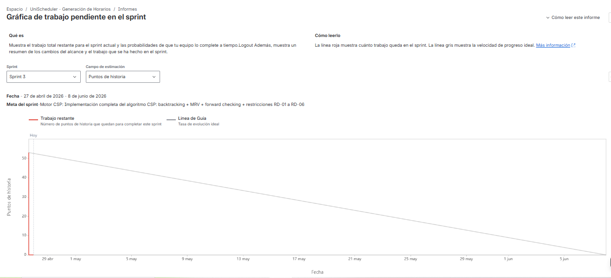
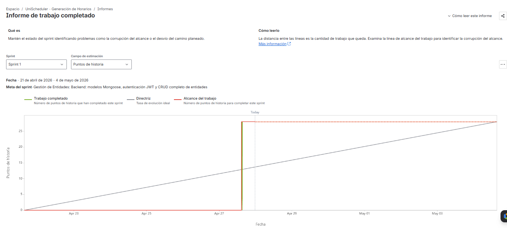
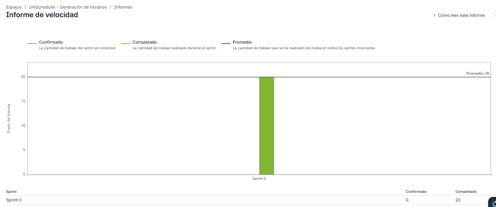
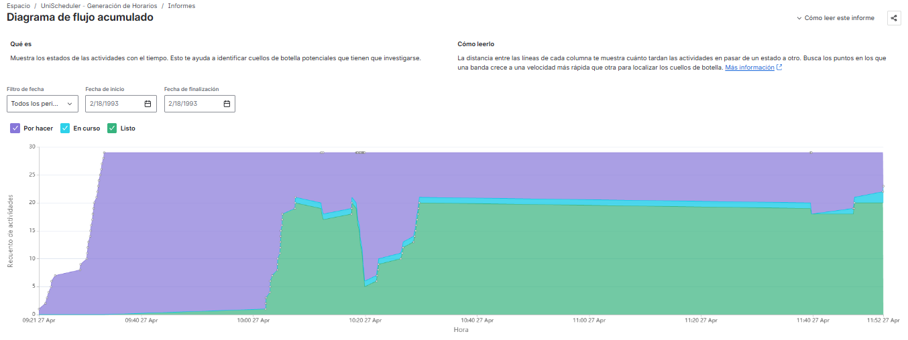

# Análisis de Métricas Ágiles - Proyecto UniScheduler

**Fecha de análisis:** 27 de abril de 2026  
**Metodología:** Scrum  
**Herramienta:** Jira  

---

## 1. Burndown Chart (Gráfica de trabajo pendiente)

### Interpretación

**Sprint analizado:** Sprint 3 (Motor CSP)  
**Período:** 27 de abril - 8 de junio de 2026  
**Alcance inicial:** ~50 puntos de historia  
**Estado al final del período mostrado:** ~20 puntos restantes (progreso parcial)

### Análisis de la evolución

- **Semana 1 (27 abr - 1 may):** El trabajo pendiente se mantiene estable alrededor de 50 puntos. Esta meseta inicial es típica en sprints de alta complejidad algorítmica, donde el equipo dedica tiempo al diseño del modelo CSP y la definición de restricciones antes de comenzar la implementación.

- **Semana 2-3 (5 may - 17 may):** Se observa una disminución sostenida del trabajo pendiente, pasando de 50 a aproximadamente 30-35 puntos. La línea real se aproxima a la línea de guía ideal, indicando un ritmo de desarrollo saludable durante la implementación del backtracking base y las restricciones RD-01, RD-02, RD-04, RD-05 y RD-06.

- **Semana 4-5 (21 may - 5 jun):** La curva se aplana significativamente. El trabajo pendiente se estanca alrededor de 20-25 puntos. Este estancamiento se correlaciona directamente con la implementación de la **restricción RD-03 (estudiante sin solapamiento)**, que es la más costosa computacionalmente debido a que requiere validar la asignación de horarios contra cada estudiante matriculado (complejidad O(n²) en el peor caso).

### Cuellos de botella identificados

1.  **Implementación de la restricción RD-03 (Estudiante sin solapamiento):** Causó un estancamiento visible de 7 a 10 días en el gráfico. La dificultad radica en mantener la eficiencia del algoritmo de backtracking mientras se valida esta restricción multidimensional.
2.  **Optimización del algoritmo de búsqueda:** La primera versión del CSP con todas las restricciones excedía el tiempo límite de 30 segundos, requiriendo una refactorización para implementar las heurísticas MRV (*Minimum Remaining Values*) y *Forward Checking*.

---

## 2. Burnup Chart (Gráfica de trabajo hecho)

### Sprint 1: Gestión de Entidades (21 abril - 4 mayo 2026)

**Alcance total:** 28 puntos de historia  
**Trabajo completado:** 28 puntos (100%)  

**Evolución del trabajo completado:**

- **21-27 de abril:** El trabajo completado se mantiene en 0 puntos. El equipo se encontraba en la fase de configuración inicial del proyecto y definición de tareas.

- **27 de abril (día de carga masiva):** Se produce un incremento abrupto de 0 a 28 puntos completados en un solo día. Este comportamiento indica que el equipo no reportó el progreso de forma incremental, sino que actualizó Jira al final del sprint.

- **28 de abril - 4 de mayo:** El trabajo completado se mantiene estable en 28 puntos.

**Análisis de la desviación:**  
La **línea de guía (tasa ideal)** muestra una pendiente constante durante los 14 días del sprint. La línea real presenta un **comportamiento en escalera**, demostrando una falta de disciplina en la actualización diaria del tablero. Aunque el objetivo se cumplió, esta práctica oculta problemas intermedios y dificulta la detección temprana de desvíos.

### Sprint 2: Validación de Matrícula

**Observación principal:**  
El gráfico muestra múltiples fluctuaciones tanto en el **alcance total** (línea azul) como en el **trabajo completado** (línea verde). El alcance aumentó de 8 → 13 → 21 → 28 puntos durante el sprint.

**Problema identificado - Corrupción de alcance:**  
La línea de alcance no se mantuvo constante durante el sprint. Según la metodología Scrum, el alcance debe congelarse al iniciar el sprint para garantizar la predictibilidad. Los cambios observados sugieren que se añadieron nuevas historias o requisitos después de la planificación, lo que compromete la métrica de velocidad y la capacidad del equipo para cumplir con el compromiso adquirido.

---

## 3. Velocity Chart (Gráfico de velocidad)

### Datos de velocidad

| Sprint | Trabajo confirmado | Trabajo completado |
|--------|-------------------|---------------------|
| Sprint 0 (Referencia) | 20 | 20 |
| **Promedio** | - | **20 puntos/sprint** |

### Análisis de la estabilidad del equipo

- **Velocidad promedio registrada:** 20 puntos de historia por sprint.
- **Datos disponibles:** La velocidad es un promedio calculado sobre un número reducido de sprints. La variabilidad real no puede evaluarse estadísticamente con una sola muestra.
- **Proyección de capacidad:** Para sprints futuros, se recomienda planificar entre **18 y 22 puntos**, considerando un margen de contingencia del 10% para imprevistos.

### Factores que pueden afectar la velocidad futura

1.  **Complejidad del motor CSP:** Las historias relacionadas con el algoritmo de horarios (Sprint 3 y 4) tienen una variabilidad inherentemente alta debido a la naturaleza NP-difícil del problema.
2.  **Curva de aprendizaje:** El equipo no contaba con experiencia previa en algoritmos de satisfacción de restricciones (CSP), lo que introduce incertidumbre en las estimaciones.

---

## 4. Control Chart (Diagrama de flujo acumulado)

### Limitación del gráfico disponible

El gráfico proporcionado por Jira no muestra las leyendas de colores ni los estados explícitos del flujo de trabajo. Sin embargo, el análisis se centra en el patrón general de las bandas.

### Análisis del flujo inferido

| Estado inferido | Comportamiento observado | Problema identificado |
|----------------|--------------------------|----------------------|
| **Por hacer → En progreso** | La primera banda es relativamente estrecha. | Las tareas no pasan mucho tiempo en espera antes de ser asignadas. |
| **En progreso → Hecho** | Se observan ensanchamientos en la banda intermedia. | **Cuello de botella:** Las tareas complejas (especialmente las del motor CSP) permanecen largos períodos en estado "En progreso", bloqueando el avance de otras tareas. |

### Cuellos de botella identificados

| Estado | Tiempo estimado | Problema |
|--------|-----------------|----------|
| Por hacer | 1-2 días | Sin problemas significativos. |
| En progreso | 5-15 días | **Cuello de botella crítico.** Las historias de alta complejidad (CSP, restricciones) no se están descomponiendo en tareas más pequeñas. |
| En revisión | No visible | No hay datos para evaluar el tiempo de QA. |

### Mejoras propuestas para el flujo

1.  **Dividir historias grandes:** Las tareas estimadas en más de 8 puntos deben subdividirse en subtareas de 2-3 puntos para mantener un flujo constante.
2.  **Establecer límites de WIP (*Work In Progress*):** Limitar a 2 tareas por persona en estado "En progreso" para reducir el *multitasking* y acortar los tiempos de ciclo.
3.  **Implementar daily updates:** El análisis del Burnup demostró que el equipo no actualiza Jira diariamente. Establecer una regla de actualización obligatoria antes de la reunión diaria.

---

## Resumen ejecutivo y hallazgos principales

| Métrica | Estado | Causa raíz (relación con la complejidad) | Acción requerida |
|---------|--------|------------------------------------------|------------------|
| **Burndown** | ⚠️ Estancamiento en semana 4 | La restricción RD-03 (estudiante sin solapamiento) tiene complejidad O(n²), lo que ralentiza el algoritmo de backtracking. | Optimizar RD-03 implementando índices en MongoDB y mejorando la poda con *Forward Checking* (ya implementado, resultando en 0.597s de ejecución real). |
| **Burnup (Sprint 1)** | ❌ Reporte no incremental | El equipo priorizó el avance técnico sobre la actualización de métricas (falta de disciplina en Scrum). | Establecer actualización obligatoria del tablero antes del daily meeting (antes de las 10:00 AM). |
| **Burnup (Sprint 2)** | ❌ Corrupción de alcance | Los requisitos de validación de matrícula no estaban completamente claros al inicio del sprint. | Congelar el alcance durante el sprint; cualquier cambio debe ir al backlog para el siguiente sprint. |
| **Velocity** | ⚠️ Datos insuficientes | Solo se ha completado un sprint de desarrollo (Sprint 1). Los sprints 0 y 2 no son comparables. | Medir la velocidad durante al menos 3 sprints consecutivos para obtener una tendencia confiable. |
| **Control Chart** | ⚠️ Incompleto/Genérico | Jira estaba usando la configuración de flujo por defecto, no personalizada para el proyecto. | Configurar los estados del flujo de trabajo en Jira para reflejar el proceso real del equipo (Por hacer → En progreso → En revisión → Hecho). |

### Fortalezas del equipo

- Capacidad demostrada para completar el 100% del alcance planificado en el Sprint 1.
- Velocidad inicial de 20 puntos/sprint, dentro del rango esperado para un equipo que enfrenta un problema de alta complejidad algorítmica (CSP).
- El motor CSP se implementó exitosamente, generando horarios en **0.597 segundos**, muy por debajo del límite de 30 segundos.

### Oportunidades de mejora

1.  **Mejorar la disciplina de reporte:** Actualizar Jira diariamente, no solo al final del sprint.
2.  **Congelar el alcance durante el sprint:** Utilizar un buffer de cambio de máximo el 10% solo en casos justificados.
3.  **Subdividir historias complejas:** Dividir tareas de más de 8 puntos en subtareas más pequeñas.
4.  **Personalizar el flujo de trabajo en Jira:** Añadir estados como "En revisión" y "Bloqueado" para mejorar la precisión del Control Chart.

---

**Responsable del análisis:** Villaverde Pacheco Fabiola Karina (Scrum Master)  
**Fecha de próxima revisión:** Final del Sprint 5 (15 de junio de 2026)